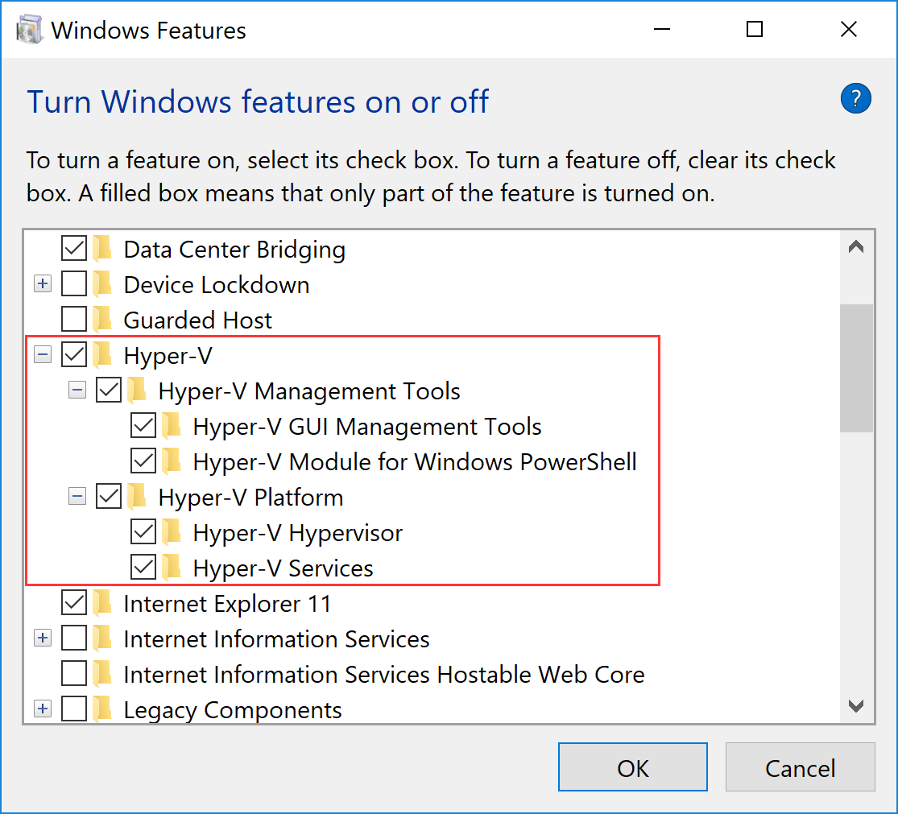
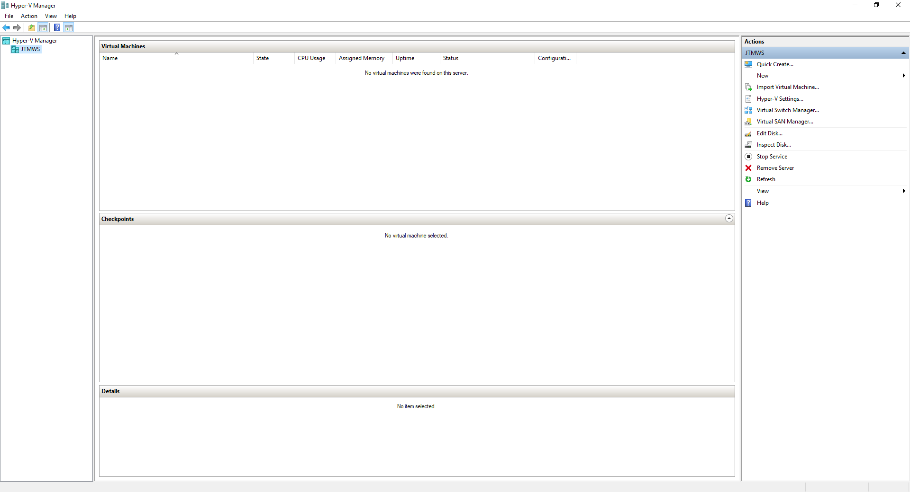

# Enable Hyper-V Feature in Windows 10
> Bulid Host Server
## Step by Step
### Enable Hyper-V Feature
> (Option 1) GUI

Open Control Panel -> All Control Panel Items<br/>
-> Programs and Features -> Turn Windows features on or off<br/>
-> Choose Hyper-V feature to install


> (Option 2) Command Line - DISM
Open up a PowerShell or command session as Administrator

```command
DISM /Online /Enable-Feature /All /FeatureName:Microsoft-Hyper-V
```

> (Option 3) Powershell
Open a PowerShell console as Administrator

```powershell
Enable-WindowsOptionalFeature -Online -FeatureName Microsoft-Hyper-V -All
```

### Restart OS

## Complete
