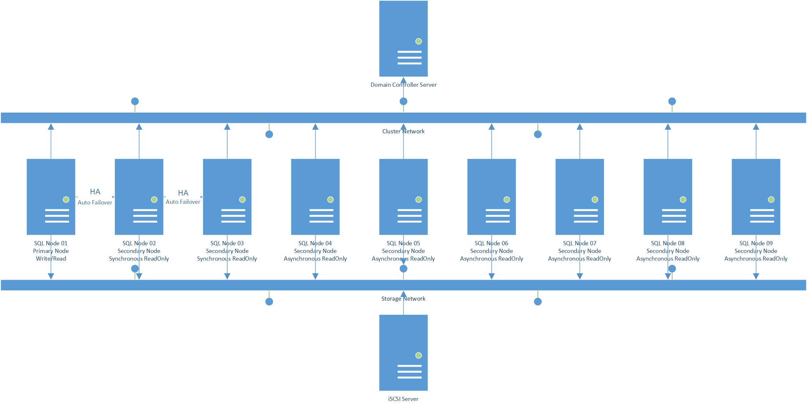

# Single Subnet HA Solution

## Software requirements
| ID | Item | Limited | Remark |
| --- | --- | --- | --- |
| 1 | Windows Server 2016 Standard Edition | Must be match SQL Server Install Image Language | Required |
| 2 | SQL Server 2017 Enterprise Edition | Must be match Windows Server Install Image Language | Required |
| 3 | SQL Server Management Studio | Must be match Windows Server Install Image Language | Option |
## Node and Hardware requirements
| ID | Item | Limited | Remark |
| --- | --- | --- | --- |
| 1 | Domain Controller | CPU 2Cores; MEM 2GB; Disk Size 32GB | Min 1 Node |
| 2 | SQL Server Node | CPU 8Cores; MEM 2GB; Disk Size 64GB | Max 9 Nodes |
| 3 | iSCIS Server Node | CPU 2Cores; MEM 2GB; Disk Size 64GB | Min 1 Nodes; 2 Disks：1 Quorum 1GB/ 1 MSDTC 4GB |
## Architecture Picture

## Network planning
P.S. [Configure Virtual Switch and Setting Default Gateway](./appendix-b-configure-virtual-switch.md)

| ID | Node Name | Item | IP | Masks | Gateway | DNS |
| --- | --- |  --- |  --- |  --- |  --- | --- |
| 01 | Domain Controller | Domain Network | 192.168.0.253 | 255.255.255.0 | 192.168.0.254 | 127.0.0.1 |
| 02 | SQL Server Node 1 | Domain Network | 192.168.0.1 | 255.255.255.0 | 192.168.0.254 | 192.168.0.253 |
| 03 | SQL Server Node 2 | Domain Network | 192.168.0.2 | 255.255.255.0 | 192.168.0.254 | 192.168.0.253 |
| 04 | SQL Server Node 3 | Domain Network | 192.168.0.3 | 255.255.255.0 | 192.168.0.254 | 192.168.0.253 |
| 05 | SQL Server Node 4 | Domain Network | 192.168.0.4 | 255.255.255.0 | 192.168.0.254 | 192.168.0.253 |
| 06 | SQL Server Node 5 | Domain Network | 192.168.0.5 | 255.255.255.0 | 192.168.0.254 | 192.168.0.253 |
| 07 | SQL Server Node 6 | Domain Network | 192.168.0.6 | 255.255.255.0 | 192.168.0.254 | 192.168.0.253 |
| 08 | SQL Server Node 7 | Domain Network | 192.168.0.7 | 255.255.255.0 | 192.168.0.254 | 192.168.0.253 |
| 09 | SQL Server Node 8 | Domain Network | 192.168.0.8 | 255.255.255.0 | 192.168.0.254 | 192.168.0.253 |
| 10 | SQL Server Node 9 | Domain Network | 192.168.0.9 | 255.255.255.0 | 192.168.0.254 | 192.168.0.253 |
| 11 | SQL Server Node 1 | Heatbeat Network | 172.168.0.1 | 255.255.0.0 | 172.168.0.254 |  |
| 12 | SQL Server Node 2 | Heatbeat Network | 172.168.0.2 | 255.255.0.0 | 172.168.0.254 |  |
| 13 | SQL Server Node 3 | Heatbeat Network | 172.168.0.3 | 255.255.0.0 | 172.168.0.254 |  |
| 14 | SQL Server Node 4 | Heatbeat Network | 172.168.0.4 | 255.255.0.0 | 172.168.0.254 |  |
| 15 | SQL Server Node 5 | Heatbeat Network | 172.168.0.5 | 255.255.0.0 | 172.168.0.254 |  |
| 16 | SQL Server Node 6 | Heatbeat Network | 172.168.0.6 | 255.255.0.0 | 172.168.0.254 |  |
| 17 | SQL Server Node 7 | Heatbeat Network | 172.168.0.7 | 255.255.0.0 | 172.168.0.254 |  |
| 18 | SQL Server Node 8 | Heatbeat Network | 172.168.0.8 | 255.255.0.0 | 172.168.0.254 |  |
| 19 | SQL Server Node 9 | Heatbeat Network | 172.168.0.9 | 255.255.0.0 | 172.168.0.254 |  |
| 20 | SQL Server Node 1 | Storage Network | 192.168.100.1 | 255.255.255.0 | 192.168.100.254 |  |
| 21 | SQL Server Node 2 | Storage Network | 192.168.100.2 | 255.255.255.0 | 192.168.100.254 |  |
| 22 | SQL Server Node 3 | Storage Network | 192.168.100.3 | 255.255.255.0 | 192.168.100.254 |  |
| 23 | SQL Server Node 4 | Storage Network | 192.168.100.4 | 255.255.255.0 | 192.168.100.254 |  |
| 24 | SQL Server Node 5 | Storage Network | 192.168.100.5 | 255.255.255.0 | 192.168.100.254 |  |
| 25 | SQL Server Node 6 | Storage Network | 192.168.100.6 | 255.255.255.0 | 192.168.100.254 |  |
| 26 | SQL Server Node 7 | Storage Network | 192.168.100.7 | 255.255.255.0 | 192.168.100.254 |  |
| 27 | SQL Server Node 8 | Storage Network | 192.168.100.8 | 255.255.255.0 | 192.168.100.254 |  |
| 28 | SQL Server Node 9 | Storage Network | 192.168.100.9 | 255.255.255.0 | 192.168.100.254 |  |
| 29 | iSCSI Server | Storage Network | 192.168.100.253 | 255.255.255.0 | 192.168.100.254 |  |
| 30 | Windows Cluster | Cluster Network | 192.168.0.10 | 255.255.255.0 | 192.168.0.254 | 192.168.0.253 |
| 31 | MSDTC Cluster | Cluster Network | 192.168.0.11 | 255.255.255.0 | 192.168.0.254 | 192.168.0.253 |
| 32 | Availability Group Listener | Cluster Network | 192.168.0.12 | 255.255.255.0 | 192.168.0.254 | 192.168.0.253 |