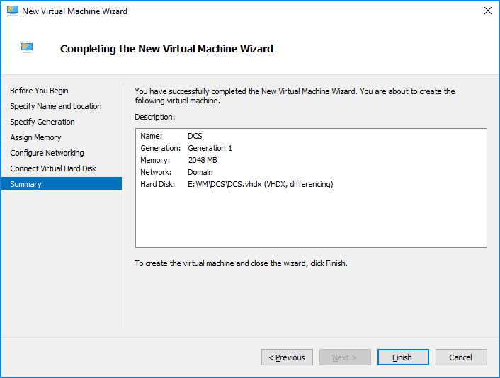
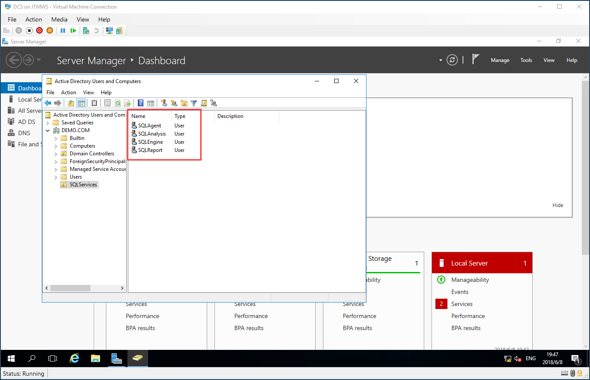

# Based-VM Template Create Domain Controller Server
## Create a New Windows Server
### Create Domain Controller Server Disk
> Choose -> File Format VHDX

> Choose -> Differncing

> Input DC Hard Disk Name and Choose Store Path

> Choose template file

> Summary Ready to Create

### Create Domain Controller Server Virtual Machine
> Input VM Name and choose store path

> Choose -> Generation 1

> Set Startup Memory 2048MB

> Choose Domain Subnet

> Choose Domain Controller Server Hard Disk

> Summary Ready to Create

### Set Domain Controller Server VM Parameters
> Parameters:
>> Processor: 8 Cores
>> Checkpoint: Clear Use automatic checkpoints

### Startup VM

> Waiting for Init

## Configure for prepare setup domain controller
### Set System Parameters
> Country/Region Language Keyboard

> Skip Windows Activation

> Accept the license

> Set Windows Administrator Password

## Add Domain Controller Roles
### Install Domain Controller Roles
> Server Manager -> Add Roles and Features

> Choose -> Role-based or feature-based installation

> Select a server from the server pool -> Choose DCS

> Clicked Roles -> Active Directory Domain Services 
Include management tools

> Do nothing -> Next

> Do nothing -> Next

> Install Roles and Features

## Configure Domain Controller
### Create Domain Controller
> Choose Promote this server to a domain controller

> Add a new forest 
Input New Domain Name

> Input DSRM Password

> Do nothing -> Next (Need New a DNS Service)

> Do nothing -> Show default NetBIOS Name

> Do nothing -> Next

> Summary for AD DC Configure

> Review Checklist

> Install DC by configures

> The Installation process need to automatic restart this computer

## Configure Domain Controller Before Installed
> Sign to this computer
Now you can see defalut login name change to Domain Administrator

> Open -> Active Directory Users and Computers

> Create a OU for management SQL Server Service Account

> OU Named: SQLServices and click protect model

> Create Domian Users in SQLService OU

> Input UserName LoginName

> Input Login Password and must be clicked Password never expires

> Show the summary

> Create Domain Users for SQL Services
>> SQLEngine: SQL Database Engine 
>> SQLAgent: SQL Agent 
>> SQLReport: SQL Reporting Service 
>> SQLAnalysis: SQL Analysis Service

