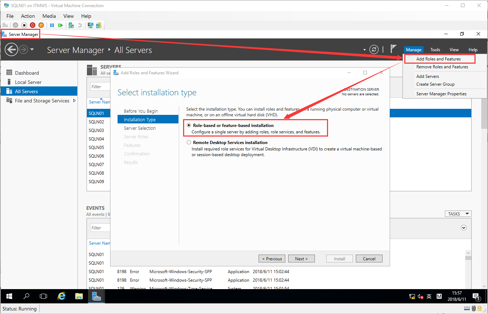

# Create Windows Cluster
## Initialize all of Node Servers
### Create Node Virtual Machine
> Reference：[Create a New Windows Server](./03-create-domain-controller.md)

### Configure Node Virtual Machine
Example：Node01
| ID | Item | Parameter | Remark |
| --- | --- | --- | --- |
| 1 | Network - Domain | IP:192.168.0.1 Masks:255.255.255.0 Gateway:192.168.0.254 DNS:192.168.0.253 | |
| 2 | Network - Heartbeat | IP:172.168.0.1 Masks:255.255.0.0 Gateway:172.168.0.254 | |
| 3 | Network - Storage | IP:192.168.100.1 Masks:255.255.255.0 Gateway:192.168.100.254 | |
| 4 | Computer Name | SQLN01 | |

### Add Node Server Join to Domain
Example：Node01
> Use a Domain User to complete for join domain

> Show welcome information

> Must be restart node computer for finish join domain task

> Login Node Use Domain Admin Account, For Create Cluster 
By default login is local account, so you need choose login by other user and input domain\domainUser to login

## Create Windows Cluster
### Installation Windows Cluster Roles and Features
> Must be install windows cluster roles and features on all of nodes 
> If want on one node install all of nodes features, Need configure Server Manager -> All Servers

> Search DEMO.COM below all servers and select you want add to group

> Then you can see all server information on this node dashboard

> Select Server Manager -> Manage -> Add Roles and Features 
Role-based or feature-based installation to install

> Select a server from the server pool -> Node Name to add some roles or features to the node

> Do nothing, Next

> Clicked Features -> Failover Clustering and add include management tools

> Review the summary, then click install to process

> You can on Server Manager check all node installation progress

### (Option)Prepare and Test current Cluster Environment
> Only need to execute once on any node 
> Select Server Manager -> Tools -> Failover Cluster Manager

> Click Validate Configuration

> Startup Validate a Configuration Wizard

> Select and add this cluster include all nodes

> Run all tests (If you know some test items configure install laster, you can skip the items)

> Review summary, then next

> Run test items, maybe need a few minutes

> All test complete, you can check required items, then clicked the Create the cluster now using the validated nodes to create cluster

### Create the Cluster
> Startup Create Cluster Wizard

> Input Cluster Name, Choose Cluster Network (192.168.0.0/24), give them a IP Address and Make sure other subnet been clean

> Review summary, Then Next

> Create Cluster, maybe need a few minutes

> Click install log

> Now, you can operate the cluster

### Check and fix Network Resource for the Cluster
> Select Failover Cluster Manager -> Networks

> Rename Network Resource Name
>
| ID | Name | Item | Subitem | Role ID |
| --- | --- | --- | --- | --- |
| 1 | Domain | Allow cluster network communication on this network | Allow clients to connect through this network | 3 |
| 2 | Heartbeat | Allow cluster network communication on this network | - | 1 |
| 3 | Storage | - | - | 0 |

> Complete

### Add Storage Resource to the Cluster
> Add Storage Resource to Cluster

> Rename Resource

### Configure Quorum for the Cluster

### Create MSDTC Application on the Cluster