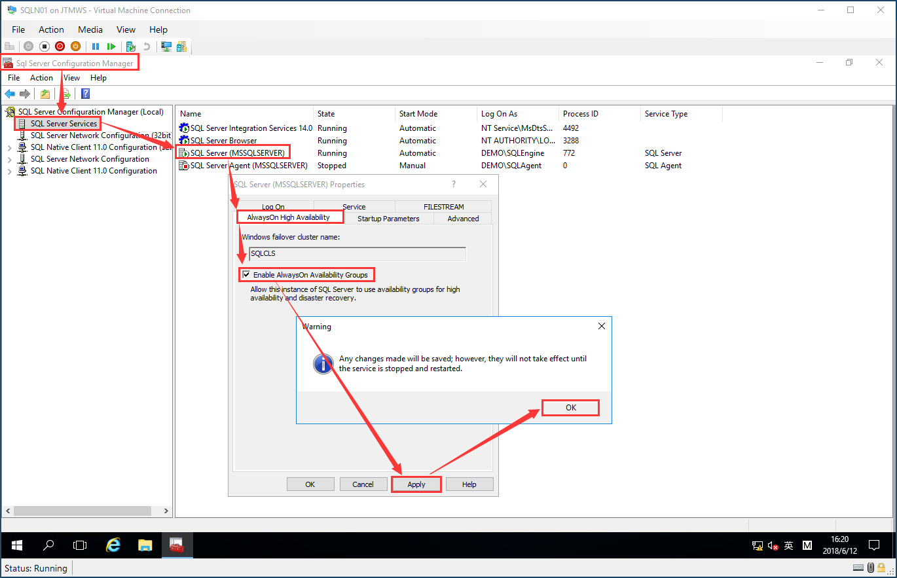
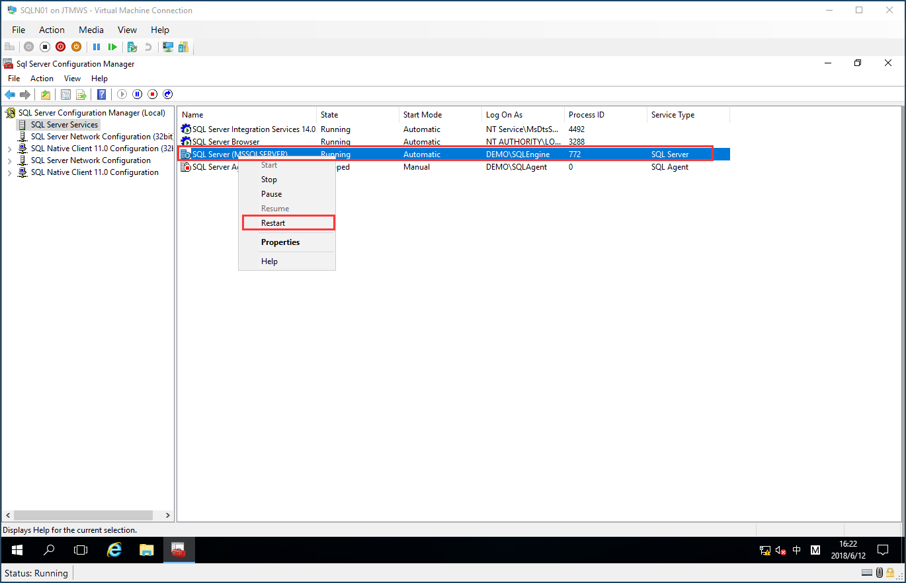
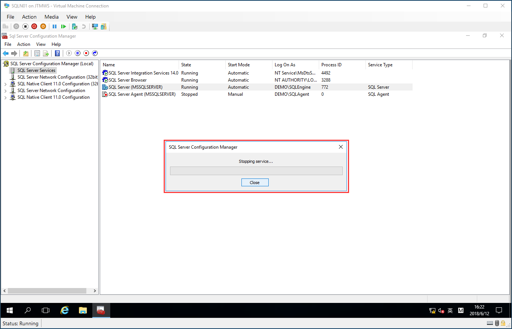

# Create SQL Server Availability Group
## Enable SQL Server Database Engine Availability Group Feature
> Each Node need configure<br/>
> Open SQL Server Congiguration Manager -> SQL Server Services -> SQL Server(InstanceName) -> Properties -> Select AlwaysOn High Availability Card -> Clicked Enable AlwaysOn Availability Groups Checkbox


> Click Apply, Need Restart Service


> Waiting few second be complet



## Install SQL Server Management Studio for Create Availability Group by T-SQL
### 1. Before creating the availability group
```sql
-- :CONNECT SQLN01 - SQLN09 Execute in all nodes

USE master
GO
-- 1. Create and start endpoint
CREATE ENDPOINT [Hadr_endpoint] 
	AS TCP (LISTENER_PORT = 5022)
	FOR DATA_MIRRORING (ROLE = ALL, ENCRYPTION = REQUIRED ALGORITHM AES)
GO

IF (SELECT state FROM sys.endpoints WHERE name = N'Hadr_endpoint') <> 0
BEGIN
	ALTER ENDPOINT [Hadr_endpoint] STATE = STARTED
END
GO

-- 2. Grant endpoint connect permissions, recommend: SQL Server Engine Service Account
GRANT CONNECT ON ENDPOINT::[Hadr_endpoint] TO [DEMO\SQLEngine]
GO

-- 3. For enable availability group database health detection feature, start XEvent session
IF EXISTS(SELECT * FROM sys.server_event_sessions WHERE name='AlwaysOn_health')
BEGIN
  ALTER EVENT SESSION [AlwaysOn_health] ON SERVER WITH (STARTUP_STATE=ON);
END
IF NOT EXISTS(SELECT * FROM sys.dm_xe_sessions WHERE name='AlwaysOn_health')
BEGIN
  ALTER EVENT SESSION [AlwaysOn_health] ON SERVER STATE=START;
END
GO
```
### 2. Creating a availability group
```sql
-- :CONNECT SQLN01 Only Execute in SQLN01 Once 

USE [master]
GO

CREATE AVAILABILITY GROUP [AGDEMO]
WITH (AUTOMATED_BACKUP_PREFERENCE = SECONDARY,
DB_FAILOVER = ON,
DTC_SUPPORT = PER_DB,
REQUIRED_SYNCHRONIZED_SECONDARIES_TO_COMMIT = 0)
FOR
	-- DATABASE [DEMODB] 
    -- create availability group frist, then create database and add to the availability group
    -- create availability group frist without user database(s)
REPLICA ON 
N'SQLN01' 
	WITH (ENDPOINT_URL = N'TCP://SQLN01.DEMO.COM:5022'
		, FAILOVER_MODE = AUTOMATIC
		, AVAILABILITY_MODE = SYNCHRONOUS_COMMIT
		, BACKUP_PRIORITY = 50
		, SEEDING_MODE = AUTOMATIC
		, SECONDARY_ROLE(ALLOW_CONNECTIONS = READ_ONLY)),
N'SQLN02' 
	WITH (ENDPOINT_URL = N'TCP://SQLN02.DEMO.COM:5022'
		, FAILOVER_MODE = AUTOMATIC
		, AVAILABILITY_MODE = SYNCHRONOUS_COMMIT
		, BACKUP_PRIORITY = 50
		, SEEDING_MODE = AUTOMATIC
		, SECONDARY_ROLE(ALLOW_CONNECTIONS = READ_ONLY)),
N'SQLN03' 
	WITH (ENDPOINT_URL = N'TCP://SQLN03.DEMO.COM:5022'
		, FAILOVER_MODE = AUTOMATIC
		, AVAILABILITY_MODE = SYNCHRONOUS_COMMIT
		, BACKUP_PRIORITY = 50
		, SEEDING_MODE = AUTOMATIC
		, SECONDARY_ROLE(ALLOW_CONNECTIONS = READ_ONLY)),
N'SQLN04' 
	WITH (ENDPOINT_URL = N'TCP://SQLN04.DEMO.COM:5022'
		, FAILOVER_MODE = MANUAL
		, AVAILABILITY_MODE = ASYNCHRONOUS_COMMIT
		, BACKUP_PRIORITY = 50
		, SEEDING_MODE = AUTOMATIC
		, SECONDARY_ROLE(ALLOW_CONNECTIONS = READ_ONLY)),
N'SQLN05' 
	WITH (ENDPOINT_URL = N'TCP://SQLN05.DEMO.COM:5022'
		, FAILOVER_MODE = MANUAL
		, AVAILABILITY_MODE = ASYNCHRONOUS_COMMIT
		, BACKUP_PRIORITY = 50
		, SEEDING_MODE = AUTOMATIC
		, SECONDARY_ROLE(ALLOW_CONNECTIONS = READ_ONLY)),
N'SQLN06' 
	WITH (ENDPOINT_URL = N'TCP://SQLN06.DEMO.COM:5022'
		, FAILOVER_MODE = MANUAL
		, AVAILABILITY_MODE = ASYNCHRONOUS_COMMIT
		, BACKUP_PRIORITY = 50
		, SEEDING_MODE = AUTOMATIC
		, SECONDARY_ROLE(ALLOW_CONNECTIONS = READ_ONLY)),
N'SQLN07' 
	WITH (ENDPOINT_URL = N'TCP://SQLN07.DEMO.COM:5022'
		, FAILOVER_MODE = MANUAL
		, AVAILABILITY_MODE = ASYNCHRONOUS_COMMIT
		, BACKUP_PRIORITY = 50
		, SEEDING_MODE = AUTOMATIC
		, SECONDARY_ROLE(ALLOW_CONNECTIONS = READ_ONLY)),
N'SQLN08' 
	WITH (ENDPOINT_URL = N'TCP://SQLN08.DEMO.COM:5022'
		, FAILOVER_MODE = MANUAL
		, AVAILABILITY_MODE = ASYNCHRONOUS_COMMIT
		, BACKUP_PRIORITY = 50
		, SEEDING_MODE = AUTOMATIC
		, SECONDARY_ROLE(ALLOW_CONNECTIONS = READ_ONLY)),
N'SQLN09' 
	WITH (ENDPOINT_URL = N'TCP://SQLN09.DEMO.COM:5022'
		, FAILOVER_MODE = MANUAL
		, AVAILABILITY_MODE = ASYNCHRONOUS_COMMIT
		, BACKUP_PRIORITY = 50
		, SEEDING_MODE = AUTOMATIC
		, SECONDARY_ROLE(ALLOW_CONNECTIONS = READ_ONLY));
GO
```
### 3. After creating the availability group
```sql
-- :CONNECT SQLN02 - SQLN09 Execute
ALTER AVAILABILITY GROUP [AGDEMO] JOIN;
GO

ALTER AVAILABILITY GROUP [AGDEMO] GRANT CREATE ANY DATABASE;
GO
```