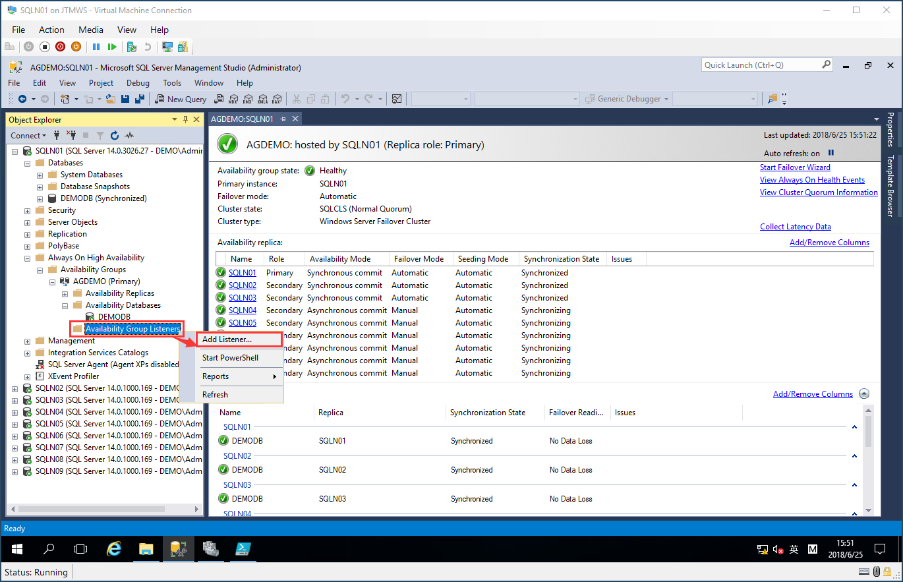
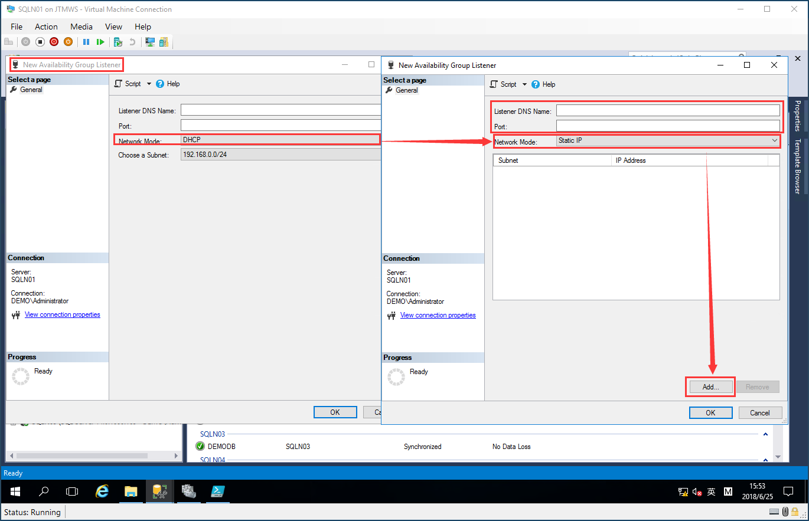
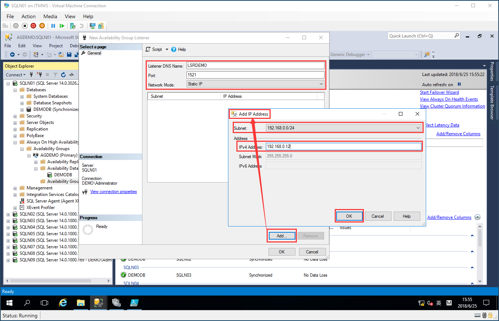
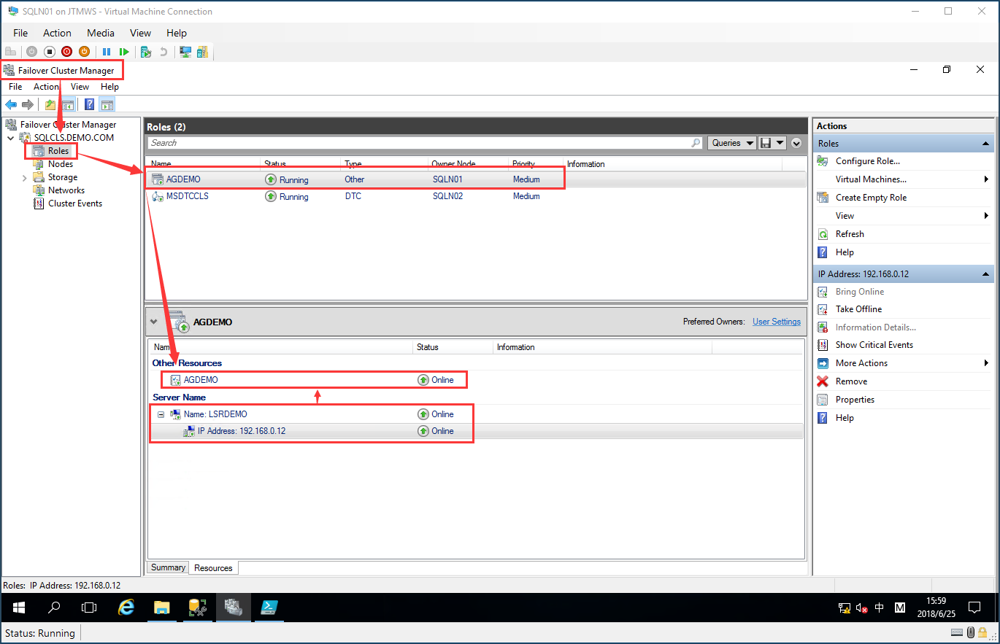

# Add Listener to Availability Group
## (Option)Create Listener By GUI
> Use SSMS GUI, Add Listener in Availability Group


> Open Listener GUI Wizard, Choose Network Mode to Static IP


> Give to them a listener name and port, and add static IP<br/>
Select Subnet 192.168.0.0/24, fill static IP to create


> Review Availability Group/ Availability Group Listener Cluster Resource in Failover Cluster Manager


## (Option)Create Listener By T-SQL
```sql
USE [master]
GO
ALTER AVAILABILITY GROUP [AGDEMO]
ADD LISTENER N'LSRDEMO' (
WITH IP
((N'192.168.0.12', N'255.255.255.0')
)
, PORT=1521);
GO
```