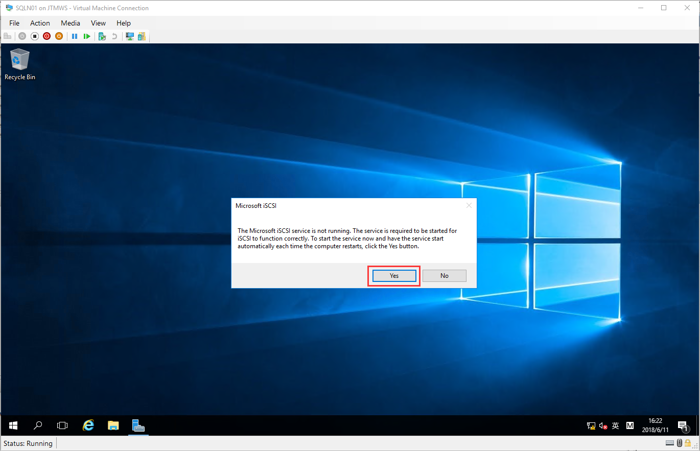

# Appendix A: Mount iSCSI Share Storage to Node
## Mount iSCSI Share Storage
> Open Server Manager -> iSCSI Initiator

> Select Yes for automatic found storage provider by each restart nodes

> Select Discovery card -> Open Discover Portal -> Input Storage Provider IP or DNS name 
By default keep port is 3260

> Select Targets, Now you can see target storage status is inactive 
We need connect to it, by each target

> Now, iSCSI Storage been mounted to current server node

## Create Volume
> Open Server Manager -> Tools -> Computer Management

> Select Disk Management -> Select each disk -> make each disk online

> Initialize Disk, Click any one disk initalize

> System can be found each status been online but not initalize disk 
Now, You can Initialize all of disk 
By default is MBR

> Now, You can create volume, If not special requirements, just create simple volume be fine

> Startup New Simple Volume Wizard

> By default, All remaining space for the current disk will be assigned to the volume

> Assign Driver Letter: 
Typically: Quorum Disk Assign Q; MSDTC Disk Assign M

> We need format current disk for frist time, keep this setting be ok

> Review Summary, Finish

> All disks need to repeat this operation 
Now, this is complete stauts

## Other Node operational has some differences
> Let disk status to online

> Maybe you need rescan all disk status 
You can see All Disk been initalized and has been automatic assigned driver letter 
But the driver letter maybe wrong, If wrong you need reassign driver letter 
Must be let all of node share disk has same driver letter 
Right click volume, Select Change Drive Letter and Paths to Change Driver letter

> Click Change, Set correct driver letter assign to current volume

> This is just warning, click Yes be ok

> Now, All of node share disk been mounted, correct assign driver letter and all volume been usable.

