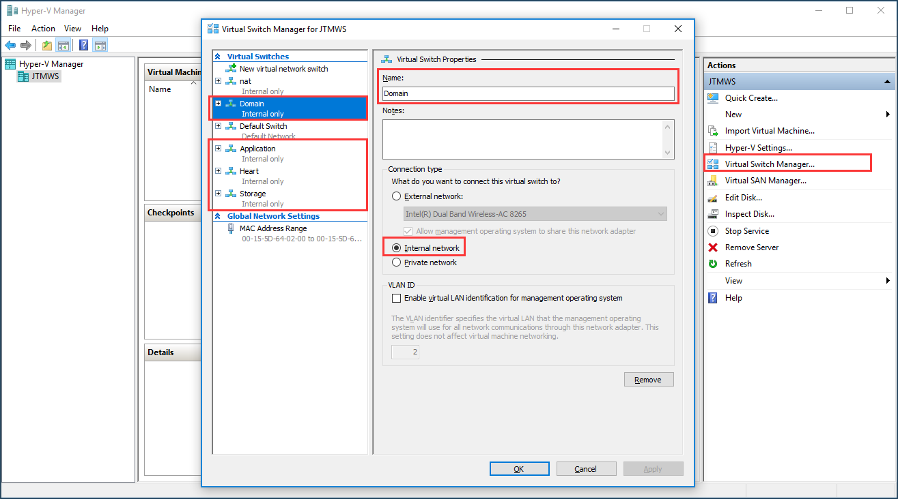
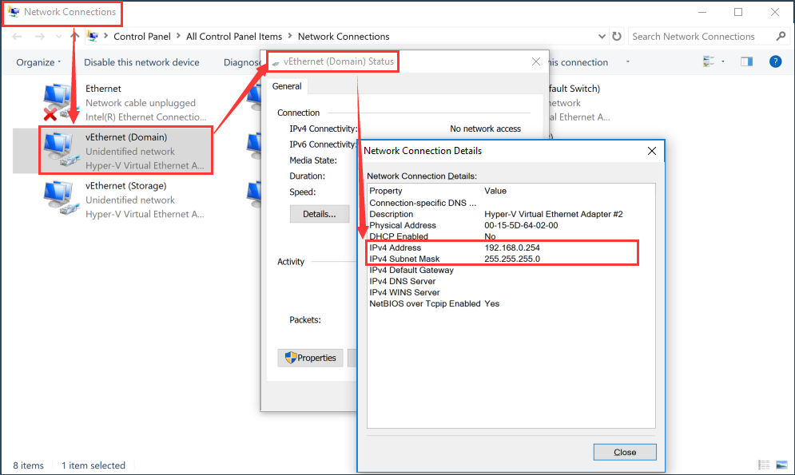

# Appendix B: Configure Virtual Switch
## Create Virtual Switch
> In Hyper-V Manager -> Actions -> Virtual Switch Manager 
New virtual network switch -> Create virtual switch 
-> Internal 
Create 4 virtual network switch:
> * Domain
> * Heartbeat
> * Storage
> * Application

> Configure Virtual Machine Default Gateway -> In Host Server Network Connections -> Select Virtual Ethernet -> Input IP Address and Marks 
The IP Address is Virtual Machine Default Gateway 
If You Configure same subnet IP, You can let virtual machine access Host Server, and Host Server can be access virtual machine 

