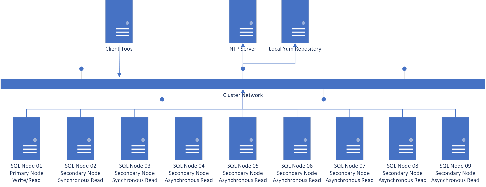

# Overview Linux HA Solution

## Software requirements
| ID | Item | Limited | Remark |
| --- | --- | --- | --- |
| 1 | CentOS 7 1806 DVD |  | Required |
| 2 | CentOS 7 1806 Everything DVD |  | Required |
| 3 | SQL Server 2017 Enterprise Edition |  | Required |
| 4 | mRemoteNG | Option | SSH Remote Terminal |
| 5 | WinSCP | Option | Upload/Download Files |

>P.S. 
* CentOS 7 [Download](https://www.centos.org) 
* SQL Server 2017 Enterprise Edition [Download](https://docs.microsoft.com/en-us/sql/linux/sql-server-linux-release-notes?view=sql-server-linux-2017) 
## Node and Hardware requirements
| ID | Item | Limited | Remark |
| --- | --- | --- | --- |
| 1 | SQL Server Node | CPU 8Cores; MEM 2GB; Disk Size 64GB | Max 9 Nodes |
| 2 | Control Node  | CPU 2Cores; MEM 2GB; Disk Size 64GB | SQL Client Tools  NTP Service  Local Yum Repository |
## Architecture Picture

## Network Planning
| ID | Node Name | Item | IP | Masks | Gateway |
| --- | --- |  --- |  --- |  --- |  --- |
| 1 | Client Tools Server | Cluster Network | 192.168.0.20 | 255.255.255.0 | 192.168.0.254 |
| 2 | SQL Server Node 1 | Cluster Network | 192.168.0.21 | 255.255.255.0 | 192.168.0.254 |
| 3 | SQL Server Node 2 | Cluster Network | 192.168.0.22 | 255.255.255.0 | 192.168.0.254 |
| 4 | SQL Server Node 3 | Cluster Network | 192.168.0.23 | 255.255.255.0 | 192.168.0.254 |
| 5 | SQL Server Node 4 | Cluster Network | 192.168.0.24 | 255.255.255.0 | 192.168.0.254 |
| 6 | SQL Server Node 5 | Cluster Network | 192.168.0.25 | 255.255.255.0 | 192.168.0.254 |
| 7 | SQL Server Node 6 | Cluster Network | 192.168.0.26 | 255.255.255.0 | 192.168.0.254 |
| 8 | SQL Server Node 7 | Cluster Network | 192.168.0.27 | 255.255.255.0 | 192.168.0.254 |
| 9 | SQL Server Node 8 | Cluster Network | 192.168.0.28 | 255.255.255.0 | 192.168.0.254 |
| 10 | SQL Server Node 9 | Cluster Network | 192.168.0.29 | 255.255.255.0 | 192.168.0.254 |
| 11 | NTP Server | Cluster Network | 192.168.0.30 | 255.255.255.0 | 192.168.0.254 |
| 12 | Yum Repository Server | Cluster Network | 192.168.0.31 | 255.255.255.0 | 192.168.0.254 |
| 13 | Pacemaker Heartbeat IP | Heartbeat IP | 192.168.0.32 | 255.255.255.0 | 192.168.0.254 |
