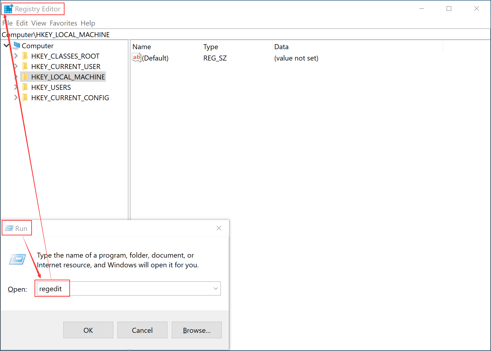
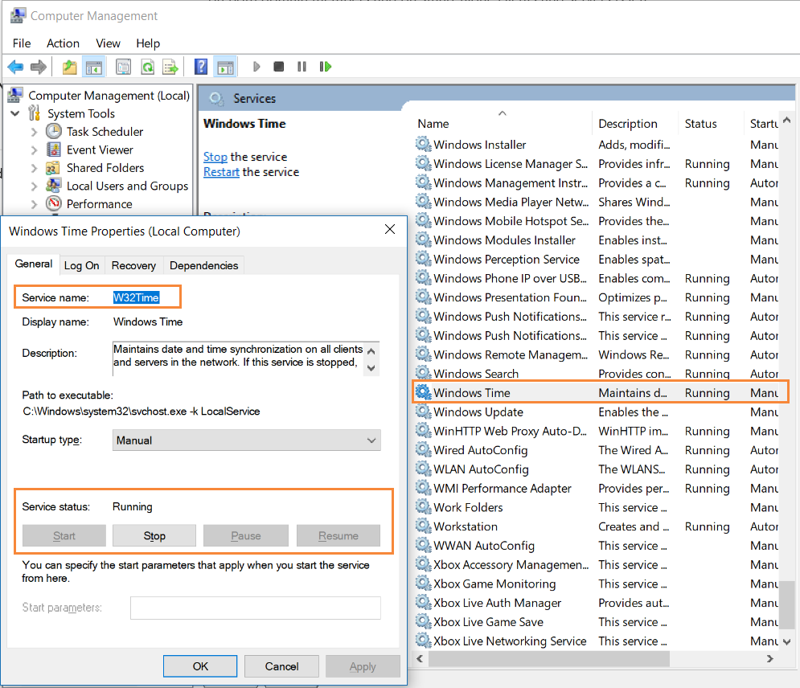
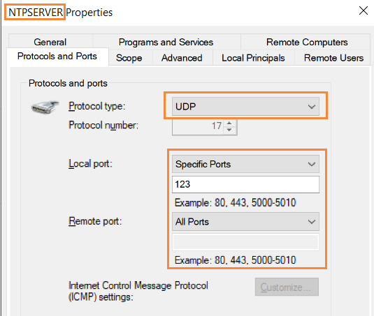

# Create NTP Server
## Configure Yum Repository
```bash
mv /etc/yum.repos.d/CentOS-Base.repo /etc/yum.repos.d/CentOS-Base.repo.bak
vi /etc/yum.repos.d/CentOS-Media.repo

# Add below content
[c7-remote]
name=CentOS-$releasever - Media
baseurl=http://192.168.0.31
gpgcheck=0
enabled=1

yum clean all
yum makecache

result:
Loaded plugins: fastestmirror
Determining fastest mirrors
c7-remote                                                                                                                                     | 2.9 kB  00:00:00
(1/3): c7-remote/primary_db                                                                                                                   | 5.9 MB  00:00:00
(2/3): c7-remote/other_db                                                                                                                     | 2.5 MB  00:00:00
(3/3): c7-remote/filelists_db                                                                                                                 | 6.9 MB  00:00:01
Metadata Cache Created
```
## Configure Host Server NTP Service(Windows)
> Reference：[Windows Time Service Tools and Settings](https://docs.microsoft.com/en-us/windows-server/networking/windows-time-service/Windows-Time-Service-Tools-and-Settings#NtpServer)

1. Step 1 Open Windows Registry
Click Windows Key + R, Open RUN, input word 'regedit'

2. Step 2 Configure Parameters
HKEY_LOCAL_MACHINE\SYSTEM\CurrentControlSet\Services\W32Time\Config -> AnnounceFlags -> 5
HKEY_LOCAL_MACHINE\SYSTEM\CurrentControlSet\Services\W32Time\TimeProviders\NtpServer -> Enabled -> 1
3. Restart W32Time Service

4. Add Firewall Role
Firewall Allow In-bound Port 123

5. Install NTP Client on each nodes
```bash
yum install ntpdate -y

result:
Loaded plugins: fastestmirror
Loading mirror speeds from cached hostfile
Resolving Dependencies
--> Running transaction check
---> Package ntpdate.x86_64 0:4.2.6p5-28.el7.centos will be installed
--> Finished Dependency Resolution

Dependencies Resolved

=====================================================================================================================================================================
 Package                            Arch                              Version                                             Repository                            Size
=====================================================================================================================================================================
Installing:
 ntpdate                            x86_64                            4.2.6p5-28.el7.centos                               c7-remote                             86 k

Transaction Summary
=====================================================================================================================================================================
Install  1 Package

Total download size: 86 k
Installed size: 121 k
Downloading packages:
ntpdate-4.2.6p5-28.el7.centos.x86_64.rpm                                                                                                      |  86 kB  00:00:00
Running transaction check
Running transaction test
Transaction test succeeded
Running transaction
  Installing : ntpdate-4.2.6p5-28.el7.centos.x86_64                                                                                                              1/1
  Verifying  : ntpdate-4.2.6p5-28.el7.centos.x86_64                                                                                                              1/1

Installed:
  ntpdate.x86_64 0:4.2.6p5-28.el7.centos

Complete!
```
6. Synchronization Date time
```bash
ntpdate 192.168.0.254

result:
 2 Jul 16:57:51 ntpdate[8519]: adjust time server 192.168.0.254 offset 0.000026 sec
```

## Configure Linux Cluster NTP Service
### Installation NTP Service
```bash
yum install ntp -y

result:
Loaded plugins: fastestmirror
Loading mirror speeds from cached hostfile
Resolving Dependencies
--> Running transaction check
---> Package ntp.x86_64 0:4.2.6p5-28.el7.centos will be installed
--> Processing Dependency: ntpdate = 4.2.6p5-28.el7.centos for package: ntp-4.2.6p5-28.el7.centos.x86_64
--> Processing Dependency: libopts.so.25()(64bit) for package: ntp-4.2.6p5-28.el7.centos.x86_64
--> Running transaction check
---> Package autogen-libopts.x86_64 0:5.18-5.el7 will be installed
---> Package ntpdate.x86_64 0:4.2.6p5-28.el7.centos will be installed
--> Finished Dependency Resolution

Dependencies Resolved

=====================================================================================================================================================================
 Package                                  Arch                            Version                                           Repository                          Size
=====================================================================================================================================================================
Installing:
 ntp                                      x86_64                          4.2.6p5-28.el7.centos                             c7-remote                          549 k
Installing for dependencies:
 autogen-libopts                          x86_64                          5.18-5.el7                                        c7-remote                           66 k
 ntpdate                                  x86_64                          4.2.6p5-28.el7.centos                             c7-remote                           86 k

Transaction Summary
=====================================================================================================================================================================
Install  1 Package (+2 Dependent packages)

Total download size: 701 k
Installed size: 1.6 M
Downloading packages:
(1/3): autogen-libopts-5.18-5.el7.x86_64.rpm                                                                                                  |  66 kB  00:00:00
(2/3): ntpdate-4.2.6p5-28.el7.centos.x86_64.rpm                                                                                               |  86 kB  00:00:00
(3/3): ntp-4.2.6p5-28.el7.centos.x86_64.rpm                                                                                                   | 549 kB  00:00:00
---------------------------------------------------------------------------------------------------------------------------------------------------------------------
Total                                                                                                                                5.5 MB/s | 701 kB  00:00:00
Running transaction check
Running transaction test
Transaction test succeeded
Running transaction
  Installing : autogen-libopts-5.18-5.el7.x86_64                                                                                                                 1/3
  Installing : ntpdate-4.2.6p5-28.el7.centos.x86_64                                                                                                              2/3
  Installing : ntp-4.2.6p5-28.el7.centos.x86_64                                                                                                                  3/3
  Verifying  : ntpdate-4.2.6p5-28.el7.centos.x86_64                                                                                                              1/3
  Verifying  : autogen-libopts-5.18-5.el7.x86_64                                                                                                                 2/3
  Verifying  : ntp-4.2.6p5-28.el7.centos.x86_64                                                                                                                  3/3

Installed:
  ntp.x86_64 0:4.2.6p5-28.el7.centos

Dependency Installed:
  autogen-libopts.x86_64 0:5.18-5.el7                                             ntpdate.x86_64 0:4.2.6p5-28.el7.centos

Complete!
```
### Configure NTP Service
```bash
vi  /etc/ntp.conf

############ Change Below Parameters:
# Hosts on local network are less restricted.
#restrict 192.168.1.0 mask 255.255.255.0 nomodify notrap
restrict 192.168.0.0 mask 255.255.255.0 nomodify

# Use public servers from the pool.ntp.org project.
# Please consider joining the pool (http://www.pool.ntp.org/join.html).
server 192.168.0.254
server 127.127.1.0      # If 192.168.0.254 no access, Use Local Server Time Source
fudge 127.127.1.0  stratum 10

#server 0.centos.pool.ntp.org iburst
#server 1.centos.pool.ntp.org iburst
#server 2.centos.pool.ntp.org iburst
#server 3.centos.pool.ntp.org iburst

# Configure Automatic Boot
systemctl enable ntpd

# Start NTP Service
systemctl start ntpd
```
### Disable and Stop Firewall
```bash
# Stop and Disable Firewall Service
systemctl stop firewalld
systemctl disable firewalld

result:
Removed symlink /etc/systemd/system/multi-user.target.wants/firewalld.service.
Removed symlink /etc/systemd/system/dbus-org.fedoraproject.FirewallD1.service.

# Disable SELinux
vi /etc/selinux/config

# from:
# SELINUX=enforcing
# to:
# SELINUX=disabled

# Reboot OS
reboot
```
### Diagnostic NTP Service
```bash
# Review NTP Service Status
systemctl status ntpd

# Review NTP Service Synchronization Status
ntpq -p

result:
     remote           refid      st t when poll reach   delay   offset  jitter
==============================================================================
 gateway         .LOCL.           1 u   18   64    1    0.502    0.052   0.000
*LOCAL(0)        .LOCL.          10 l   17   64    1    0.000    0.000   0.000

ntpdate -d 192.168.0.30

result:
ERROR REPORT:
 2 Jul 17:55:16 ntpdate[1187]: ntpdate 4.2.6p5@1.2349-o Fri Apr 13 12:52:28 UTC 2018 (1)
Looking for host 192.168.0.30 and service ntp
host found : 192.168.0.30
transmit(192.168.0.30)
receive(192.168.0.30)
transmit(192.168.0.30)
receive(192.168.0.30)
transmit(192.168.0.30)
receive(192.168.0.30)
transmit(192.168.0.30)
receive(192.168.0.30)
192.168.0.30: Server dropped: strata too high # Must be set stratum 0-15
server 192.168.0.30, port 123
stratum 16, precision -23, leap 11, trust 000
refid [192.168.0.30], delay 0.02611, dispersion 0.00015
transmitted 4, in filter 4
reference time:    00000000.00000000  Mon, Jan  1 1900  8:05:43.000
originate timestamp: dee4750a.ddfa20c6  Mon, Jul  2 2018 17:55:22.867
transmit timestamp:  dee4750a.dddf6c0b  Mon, Jul  2 2018 17:55:22.866
filter delay:  0.02818  0.02623  0.02625  0.02611
         0.00000  0.00000  0.00000  0.00000
filter offset: 0.000990 0.000144 -0.00004 0.000109
         0.000000 0.000000 0.000000 0.000000
delay 0.02611, dispersion 0.00015
offset 0.000109

 2 Jul 17:55:22 ntpdate[1187]: no server suitable for synchronization found

NORMAL REPORT:
  2 Jul 18:02:16 ntpdate[1206]: ntpdate 4.2.6p5@1.2349-o Fri Apr 13 12:52:28 UTC 2018 (1)
Looking for host 192.168.0.30 and service ntp
host found : 192.168.0.30
transmit(192.168.0.30)
receive(192.168.0.30)
transmit(192.168.0.30)
receive(192.168.0.30)
transmit(192.168.0.30)
receive(192.168.0.30)
transmit(192.168.0.30)
receive(192.168.0.30)
server 192.168.0.30, port 123
stratum 11, precision -23, leap 00, trust 000
refid [192.168.0.30], delay 0.02602, dispersion 0.00117
transmitted 4, in filter 4
reference time:    dee4768a.eaeb0c9d  Mon, Jul  2 2018 18:01:46.917
originate timestamp: dee476ae.54e80108  Mon, Jul  2 2018 18:02:22.331
transmit timestamp:  dee476ae.54d0bd1c  Mon, Jul  2 2018 18:02:22.331
filter delay:  0.02602  0.02614  0.04561  0.02672
         0.00000  0.00000  0.00000  0.00000
filter offset: 0.000071 0.000063 -0.00879 -0.00026
         0.000000 0.000000 0.000000 0.000000
delay 0.02602, dispersion 0.00117
offset 0.000071

 2 Jul 18:02:22 ntpdate[1206]: adjust time server 192.168.0.30 offset 0.000071 sec
```
## Configure Linux Cluster NTP Client
Add Auto Job to Each Node
```bash
crontab -e
00 01 * * * root /usr/sbin/ntpdate 192.168.0.30; /sbin/hwclock -w
# Timer: Everyday, Morning 1 clock
# Min, Hour, Day, Month, Year
```