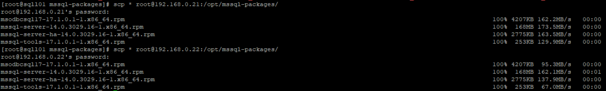

# Installation SQL Server on Linux
## Get SQL Server on Linux Installation Packages
| ID | Item | File Name | Remark |
| --- | --- | --- | --- |
| 1 | Database Engine | [mssql-server-14.0.3029.16-1.x86_64.rpm](https://packages.microsoft.com/rhel/7/mssql-server-2017/mssql-server-14.0.3029.16-1.x86_64.rpm) | CU8 |
| 2 | High Availability |[mssql-server-ha-14.0.3029.16-1.x86_64.rpm](https://packages.microsoft.com/rhel/7/mssql-server-2017/mssql-server-ha-14.0.3029.16-1.x86_64.rpm) | CU8 |
| 3 | Microsoft SQL ODBC Driver on Linux | [msodbcsql17-17.1.0.1-1.x86_64.rpm](https://packages.microsoft.com/rhel/7/prod/msodbcsql17-17.1.0.1-1.x86_64.rpm) | CU8 |
| 4 | Microsoft SQL Tools on Linux | [mssql-tools-17.1.0.1-1.x86_64.rpm](https://packages.microsoft.com/rhel/7/prod/mssql-tools-17.1.0.1-1.x86_64.rpm) | CU8 |
## Upload SQL Server on Linux Installation Packages to Nodes
> Copy installation packages from sqll01 to other all of nodes by scp


```bash
# You can configure ssh without password login on the before
scp * root@192.168.0.21:/opt/mssql-packages/
scp * root@192.168.0.22:/opt/mssql-packages/
scp * root@192.168.0.23:/opt/mssql-packages/
scp * root@192.168.0.24:/opt/mssql-packages/
scp * root@192.168.0.25:/opt/mssql-packages/
scp * root@192.168.0.26:/opt/mssql-packages/
scp * root@192.168.0.27:/opt/mssql-packages/
scp * root@192.168.0.28:/opt/mssql-packages/
scp * root@192.168.0.29:/opt/mssql-packages/
```
> P.S. [Appendix A: SSH Login without Password](./appendix-a-ssh-without-password-login.md)
## Installation SQL Server on Linux
```bash
yum install /opt/mssql-packages/mssql-server-14.0.3029.16-1.x86_64.rpm -y

result:
Loaded plugins: fastestmirror
Examining /opt/mssql-packages/mssql-server-14.0.3029.16-1.x86_64.rpm: mssql-server-14.0.3029.16-1.x86_64
Marking /opt/mssql-packages/mssql-server-14.0.3029.16-1.x86_64.rpm to be installed
Resolving Dependencies
--> Running transaction check
---> Package mssql-server.x86_64 0:14.0.3029.16-1 will be installed
--> Processing Dependency: bzip2 for package: mssql-server-14.0.3029.16-1.x86_64
Loading mirror speeds from cached hostfile
c7-remote                                                                                                                                     | 2.9 kB  00:00:00
--> Processing Dependency: gdb for package: mssql-server-14.0.3029.16-1.x86_64
--> Processing Dependency: libsss_nss_idmap for package: mssql-server-14.0.3029.16-1.x86_64
--> Running transaction check
---> Package bzip2.x86_64 0:1.0.6-13.el7 will be installed
---> Package gdb.x86_64 0:7.6.1-110.el7 will be installed
---> Package libsss_nss_idmap.x86_64 0:1.16.0-19.el7 will be installed
--> Finished Dependency Resolution

Dependencies Resolved

=====================================================================================================================================================================
 Package                              Arch                       Version                               Repository                                               Size
=====================================================================================================================================================================
Installing:
 mssql-server                         x86_64                     14.0.3029.16-1                        /mssql-server-14.0.3029.16-1.x86_64                     891 M
Installing for dependencies:
 bzip2                                x86_64                     1.0.6-13.el7                          c7-remote                                                52 k
 gdb                                  x86_64                     7.6.1-110.el7                         c7-remote                                               2.4 M
 libsss_nss_idmap                     x86_64                     1.16.0-19.el7                         c7-remote                                               147 k

Transaction Summary
=====================================================================================================================================================================
Install  1 Package (+3 Dependent packages)

Total size: 893 M
Total download size: 2.6 M
Installed size: 898 M
Downloading packages:
(1/3): bzip2-1.0.6-13.el7.x86_64.rpm                                                                                                          |  52 kB  00:00:00
(2/3): libsss_nss_idmap-1.16.0-19.el7.x86_64.rpm                                                                                              | 147 kB  00:00:00
(3/3): gdb-7.6.1-110.el7.x86_64.rpm                                                                                                           | 2.4 MB  00:00:00
---------------------------------------------------------------------------------------------------------------------------------------------------------------------
Total                                                                                                                                 11 MB/s | 2.6 MB  00:00:00
Running transaction check
Running transaction test
Transaction test succeeded
Running transaction
  Installing : libsss_nss_idmap-1.16.0-19.el7.x86_64                                                                                                             1/4
  Installing : bzip2-1.0.6-13.el7.x86_64                                                                                                                         2/4
  Installing : gdb-7.6.1-110.el7.x86_64                                                                                                                          3/4
  Installing : mssql-server-14.0.3029.16-1.x86_64                                                                                                                4/4

+--------------------------------------------------------------+
Please run 'sudo /opt/mssql/bin/mssql-conf setup'
to complete the setup of Microsoft SQL Server
+--------------------------------------------------------------+

SQL Server needs to be restarted in order to apply this setting. Please run
'systemctl restart mssql-server.service'.
  Verifying  : gdb-7.6.1-110.el7.x86_64                                                                                                                          1/4
  Verifying  : bzip2-1.0.6-13.el7.x86_64                                                                                                                         2/4
  Verifying  : libsss_nss_idmap-1.16.0-19.el7.x86_64                                                                                                             3/4
  Verifying  : mssql-server-14.0.3029.16-1.x86_64                                                                                                                4/4

Installed:
  mssql-server.x86_64 0:14.0.3029.16-1

Dependency Installed:
  bzip2.x86_64 0:1.0.6-13.el7                        gdb.x86_64 0:7.6.1-110.el7                        libsss_nss_idmap.x86_64 0:1.16.0-19.el7

Complete!
```
## Installation SQL Server on Linux Tools
```bash
# 1. Install msodbcsql17-*.x86_64.rpm
yum install /opt/mssql-packages/msodbcsql17-17.1.0.1-1.x86_64.rpm -y

result:
Loaded plugins: fastestmirror
Examining /opt/mssql-packages/msodbcsql17-17.1.0.1-1.x86_64.rpm: msodbcsql17-17.1.0.1-1.x86_64
Marking /opt/mssql-packages/msodbcsql17-17.1.0.1-1.x86_64.rpm to be installed
Resolving Dependencies
--> Running transaction check
---> Package msodbcsql17.x86_64 0:17.1.0.1-1 will be installed
--> Processing Dependency: unixODBC >= 2.3.1 for package: msodbcsql17-17.1.0.1-1.x86_64
Loading mirror speeds from cached hostfile
--> Processing Dependency: libodbcinst.so.2()(64bit) for package: msodbcsql17-17.1.0.1-1.x86_64
--> Running transaction check
---> Package unixODBC.x86_64 0:2.3.1-11.el7 will be installed
--> Processing Dependency: libltdl.so.7()(64bit) for package: unixODBC-2.3.1-11.el7.x86_64
--> Running transaction check
---> Package libtool-ltdl.x86_64 0:2.4.2-22.el7_3 will be installed
--> Finished Dependency Resolution

Dependencies Resolved

=====================================================================================================================================================================
 Package                             Arch                          Version                               Repository                                             Size
=====================================================================================================================================================================
Installing:
 msodbcsql17                         x86_64                        17.1.0.1-1                            /msodbcsql17-17.1.0.1-1.x86_64                         17 M
Installing for dependencies:
 libtool-ltdl                        x86_64                        2.4.2-22.el7_3                        c7-remote                                              49 k
 unixODBC                            x86_64                        2.3.1-11.el7                          c7-remote                                             413 k

Transaction Summary
=====================================================================================================================================================================
Install  1 Package (+2 Dependent packages)

Total size: 17 M
Total download size: 462 k
Installed size: 18 M
Downloading packages:
(1/2): libtool-ltdl-2.4.2-22.el7_3.x86_64.rpm                                                                                                 |  49 kB  00:00:00
(2/2): unixODBC-2.3.1-11.el7.x86_64.rpm                                                                                                       | 413 kB  00:00:00
---------------------------------------------------------------------------------------------------------------------------------------------------------------------
Total                                                                                                                                3.2 MB/s | 462 kB  00:00:00
Running transaction check
Running transaction test
Transaction test succeeded
Running transaction
  Installing : libtool-ltdl-2.4.2-22.el7_3.x86_64                                                                                                                1/3
  Installing : unixODBC-2.3.1-11.el7.x86_64                                                                                                                      2/3
The license terms for this product can be downloaded from
https://aka.ms/odbc170eula and found in
/usr/share/doc/msodbcsql17/LICENSE.txt . By entering 'YES',
you indicate that you accept the license terms.

Do you accept the license terms? (Enter YES or NO)
YES
  Installing : msodbcsql17-17.1.0.1-1.x86_64                                                                                                                     3/3
  Verifying  : unixODBC-2.3.1-11.el7.x86_64                                                                                                                      1/3
  Verifying  : msodbcsql17-17.1.0.1-1.x86_64                                                                                                                     2/3
  Verifying  : libtool-ltdl-2.4.2-22.el7_3.x86_64                                                                                                                3/3

Installed:
  msodbcsql17.x86_64 0:17.1.0.1-1

Dependency Installed:
  libtool-ltdl.x86_64 0:2.4.2-22.el7_3                                                 unixODBC.x86_64 0:2.3.1-11.el7

Complete!

# 2. Install mssql-tools-*.x86_64.rpm
yum install /opt/mssql-packages/mssql-tools-17.1.0.1-1.x86_64.rpm -y

result:
Loaded plugins: fastestmirror
Examining /opt/mssql-packages/mssql-tools-17.1.0.1-1.x86_64.rpm: mssql-tools-17.1.0.1-1.x86_64
Marking /opt/mssql-packages/mssql-tools-17.1.0.1-1.x86_64.rpm to be installed
Resolving Dependencies
--> Running transaction check
---> Package mssql-tools.x86_64 0:17.1.0.1-1 will be installed
--> Finished Dependency Resolution

Dependencies Resolved

=====================================================================================================================================================================
 Package                             Arch                           Version                             Repository                                              Size
=====================================================================================================================================================================
Installing:
 mssql-tools                         x86_64                         17.1.0.1-1                          /mssql-tools-17.1.0.1-1.x86_64                         864 k

Transaction Summary
=====================================================================================================================================================================
Install  1 Package

Total size: 864 k
Installed size: 864 k
Downloading packages:
Running transaction check
Running transaction test
Transaction test succeeded
Running transaction
The license terms for this product can be downloaded from
http://go.microsoft.com/fwlink/?LinkId=746949 and found in
/usr/share/doc/mssql-tools/LICENSE.txt . By entering 'YES',
you indicate that you accept the license terms.

Do you accept the license terms? (Enter YES or NO)
YES
  Installing : mssql-tools-17.1.0.1-1.x86_64                                                                                                                     1/1
  Verifying  : mssql-tools-17.1.0.1-1.x86_64                                                                                                                     1/1

Installed:
  mssql-tools.x86_64 0:17.1.0.1-1

Complete!
```