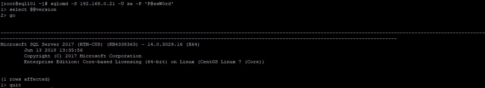

# Configure SQL Server and Linux 
## Configure SQL Server Instance
```bash
# Setup SQL Server Instance on each nodes
ACCEPT_EULA=Y MSSQL_COLLATION='Chinese_PRC_CI_AS' MSSQL_LCID='1033' MSSQL_SA_PASSWORD='P@ssW0rd' MSSQL_PID='EnterpriseCore' /opt/mssql/bin/mssql-conf setup

result:
The license terms for this product can be found in
/usr/share/doc/mssql-server or downloaded from:
https://go.microsoft.com/fwlink/?LinkId=855862&clcid=0x409

The privacy statement can be viewed at:
https://go.microsoft.com/fwlink/?LinkId=853010&clcid=0x409

Setting language using LCID from environment variable MSSQL_LCID
Configuring SQL Server...

The licensing PID was successfully processed. The new edition is [Enterprise Edition: Core-based Licensing].
ForceFlush is enabled for this instance.
ForceFlush feature is enabled for log durability.
Created symlink from /etc/systemd/system/multi-user.target.wants/mssql-server.service to /usr/lib/systemd/system/mssql-server.service.
Setup has completed successfully. SQL Server is now starting.
```
> P.S. 
* [Configure SQL Server settings with environment variables on Linux](https://docs.microsoft.com/en-us/sql/linux/sql-server-linux-configure-environment-variables?view=sql-server-linux-2017)
* [Configure SQL Server on Linux with the mssql-conf tool](https://docs.microsoft.com/en-us/sql/linux/sql-server-linux-configure-mssql-conf?view=sql-server-linux-2017)
> Special Instructions:<br/>
* MSSQL_PID:
    * Evaluation
    * Developer
    * Express
    * Web
    * Standard
    * Enterprise
    * A product key
    * EnterpriseCore - (Not in Microosft Docs) Enterprise different from EnterpriseCore (Reference: [Compute capacity limits by edition of SQL Server](https://docs.microsoft.com/en-us/sql/sql-server/compute-capacity-limits-by-edition-of-sql-server?view=sql-server-2017))
    
* MSSQL_LCID
    * Find LCID Code (Reference: [sys.syslanguages (Transact-SQL)](https://docs.microsoft.com/en-us/sql/relational-databases/system-compatibility-views/sys-syslanguages-transact-sql?view=sql-server-2017))
    ```sql
        select name, alias, lcid from sys.syslanguages
    ```
* MSSQL_COLLATION
    * Find COLLATION (Reference: [Collations](https://docs.microsoft.com/en-us/sql/t-sql/statements/collations?view=sql-server-2017))
    * Windows Collation (Reference: [Windows Collation Name (Transact-SQL)](https://docs.microsoft.com/en-us/sql/t-sql/statements/windows-collation-name-transact-sql?view=sql-server-2017))
    ```sql
    SELECT * FROM sys.fn_helpcollations() WHERE name NOT LIKE 'SQL%';
    ```
    * SQL Collation (Reference: [SQL Server Collation Name (Transact-SQL)](https://docs.microsoft.com/en-us/sql/t-sql/statements/sql-server-collation-name-transact-sql?view=sql-server-2017))
    ```sql
    SELECT * FROM sys.fn_helpcollations() WHERE name LIKE 'SQL%';
    ```
## SQL Server Maintenance
```bash
systemctl status mssql-server
# Option: systemctl status|enable|disable|start|stop|restart mssql-server

result:
● mssql-server.service - Microsoft SQL Server Database Engine
   Loaded: loaded (/usr/lib/systemd/system/mssql-server.service; enabled; vendor preset: disabled)
   Active: active (running) since Tue 2018-07-03 15:06:36 CST; 1h 5min ago
     Docs: https://docs.microsoft.com/en-us/sql/linux
 Main PID: 2072 (sqlservr)
   CGroup: /system.slice/mssql-server.service
           ├─2072 /opt/mssql/bin/sqlservr
           └─2092 /opt/mssql/bin/sqlservr

Jul 03 15:06:39 sqll01 sqlservr[2072]: 2018-07-03 15:06:39.87 spid10s     Recovery is writing a checkpoint in database 'model' (3). This is an informati... required.
Jul 03 15:06:39 sqll01 sqlservr[2072]: 2018-07-03 15:06:39.87 spid6s      Recovery is writing a checkpoint in database 'msdb' (4). This is an informatio... required.
Jul 03 15:06:40 sqll01 sqlservr[2072]: 2018-07-03 15:06:40.04 spid10s     Polybase feature disabled.
Jul 03 15:06:40 sqll01 sqlservr[2072]: 2018-07-03 15:06:40.04 spid10s     Clearing tempdb database.
Jul 03 15:06:40 sqll01 sqlservr[2072]: 2018-07-03 15:06:40.49 spid10s     Starting up database 'tempdb'.
Jul 03 15:06:40 sqll01 sqlservr[2072]: 2018-07-03 15:06:40.74 spid10s     The tempdb database has 1 data file(s).
Jul 03 15:06:40 sqll01 sqlservr[2072]: 2018-07-03 15:06:40.75 spid24s     The Service Broker endpoint is in disabled or stopped state.
Jul 03 15:06:40 sqll01 sqlservr[2072]: 2018-07-03 15:06:40.75 spid24s     The Database Mirroring endpoint is in disabled or stopped state.
Jul 03 15:06:40 sqll01 sqlservr[2072]: 2018-07-03 15:06:40.76 spid24s     Service Broker manager has started.
Jul 03 15:06:40 sqll01 sqlservr[2072]: 2018-07-03 15:06:40.86 spid6s      Recovery is complete. This is an informational message only. No user action is required.
Hint: Some lines were ellipsized, use -l to show in full.
```
## Configure SQL Server Tools
> Adding environment variables for SQL Tools

```bash
echo 'export PATH="$PATH:/opt/mssql-tools/bin"' >> ~/.bash_profile
echo 'export PATH="$PATH:/opt/mssql-tools/bin"' >> ~/.bashrc
source ~/.bashrc
source ~/.bash_profile
```
> Use SQL Tools

Reference:
* [sqlcmd Utility](https://docs.microsoft.com/en-us/sql/tools/sqlcmd-utility?view=sql-server-2017&viewFallbackFrom=sql-server-linux-2017)
    
* [bcp Utility](https://docs.microsoft.com/en-us/sql/tools/bcp-utility?view=sql-server-2017&viewFallbackFrom=sql-server-linux-2017)
## Configure Linux
