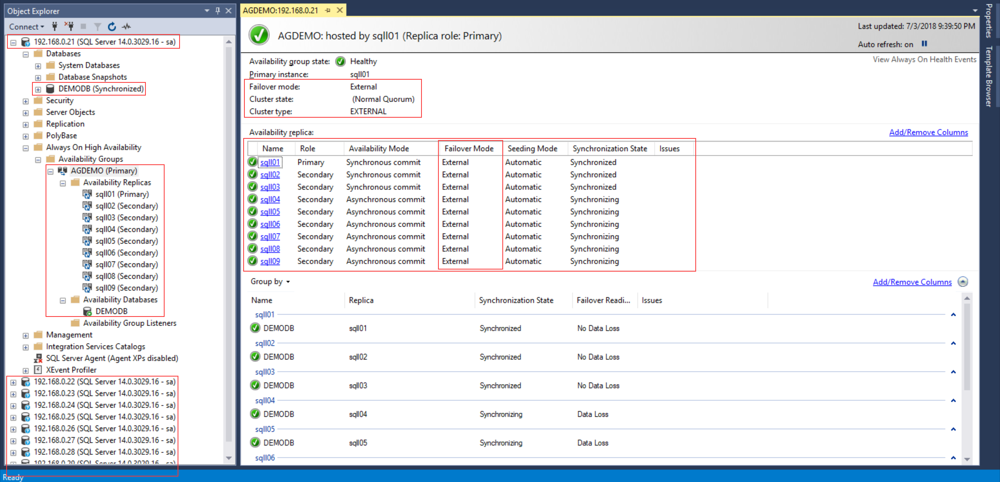

# Create Database and join to Availability Group
## Allow New User Database Add to Availability Group
```sql
-- Execute on all of Instance
USE master
GO

ALTER AVAILABILITY GROUP [AGDEMO] GRANT CREATE ANY DATABASE
GO
```
## Create Database and Join to availability group
```sql
-- :CONNECT SQLN01 Only Execute in SQLN01 Once
-- Create User Database in specify directory
CREATE DATABASE DEMODB
ON PRIMARY
	(NAME = DEMODB_DATA,
	  FILENAME = N'/var/opt/mssql/demodb_data.mdf',
          SIZE = 8MB,
          FILEGROWTH = 0)
LOG ON
	( NAME = DEMODB_LOG,
	  FILENAME = N'/var/opt/mssql/demodb_log.ldf',
          SIZE = 16MB,
          FILEGROWTH = 128MB)
GO

-- Full backup the user database, for enable restore start point, then you can delete the backup file
BACKUP DATABASE DEMODB TO DISK = '/var/opt/mssql/DEMODB.bak'
GO

-- Add the user database to specify availability group
ALTER AVAILABILITY GROUP [AGDEMO] ADD DATABASE [DEMODB]
GO
```
## Review Availability Group Dashboard
