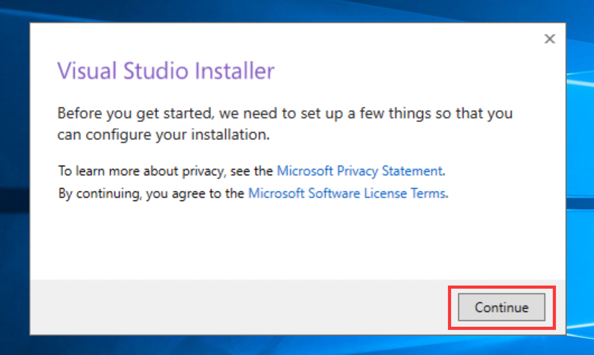
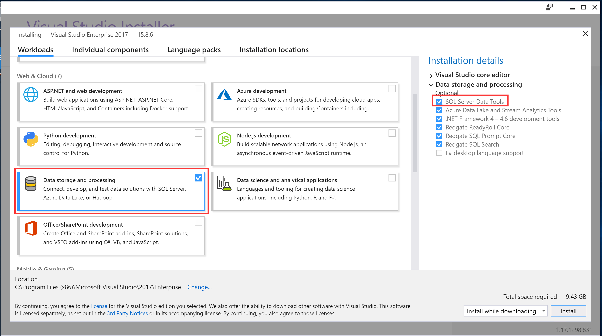

# SQL Server Development Environment Offline Installation
## Software requirements
| ID | Item | Remark | Download | Size |
| --- | --- | --- | --- | --- |
| 1 | Visual Studio 2017 | Online | [Download](https://visualstudio.microsoft.com/downloads/)| 1.2MB |
| 2 | SQL Server Data Tools | Online | [Download](https://go.microsoft.com/fwlink/?linkid=2014060)| 1.5MB |
| 3 | Data-Tier Application Framework (DacFx) | Full package | [Download](https://www.microsoft.com/en-us/download/details.aspx?id=56508)|  5.5MB |
| 4 | SQL Server Management Studio | Full package | [Download](https://docs.microsoft.com/en-us/sql/ssms/download-sql-server-management-studio-ssms?view=sql-server-2017)| 807MB |
> P.S. Must be match Windows Server Language

## Get offline installation packages
### Visual Studio 2017
> File Name: vs_enterprise.exe
```command
vs_enterprise.exe --layout X:\VS2017ENT\Packages --lang en-US zh-CN
```
Show:
-- Download Visual Studio Online Installer

-- Startup Visual Studio Online Installer by Command Lines

-- Maybe need waiting few hours by your network bandwidth

-- Download complete

-- Full package size over 42 GB

> P.S. <br/>
* First time download or offline packages update with the same script
* [Create an offline installation of Visual Studio 2017](https://docs.microsoft.com/en-us/visualstudio/install/create-an-offline-installation-of-visual-studio?view=vs-2017)
* [List of language locales](https://docs.microsoft.com/en-us/visualstudio/install/create-an-offline-installation-of-visual-studio?view=vs-2017#list-of-language-locales)<br/>


### SQL Server Data Tools
> File Name: SSDT-Setup-ENU.exe
```command
SSDT-Setup-ENU.exe /layout X:\SSDT2017\Packages
```
-- Startup SSDT Online Installer begin for download

-- Download complete

> P.S. First time download or offline packages update with the same script

## Create Share Folder
```powershell
// Powershell Run as Administrator
New-SmbShare -Name "VS2017ENT" -Path "X:\VS2017ENT\Packages" -ReadAccess "Everyone"
New-SmbShare -Name "SSDT2017" -Path "X:\SSDT2017\Packages" -ReadAccess "Everyone"
```
> P.S.<br/>
Share Visual Studio Packages Floder<br/>

Share SQL Server Data Tools Packages Floder<br/>


## Installation order
1. Install SQL Server Management Studio

2. Install Visual Studio 2017
Open shared folder

Enter access user name and password
> P.S.<br/>
If do not choose checkbox remember login information

Find and execute vs_setup.exe

Review and continue agreement

Failure！Can not be access local or remote files


Enter access user name and password
> P.S.<br/>
Choose checkbox remember login information

Installer finded need files

Installer download and install file from shared folder

Choose Data Storage and Processing for install SSDT shell

Wating for download and install complete

Visual Studio 2017 offline install completed

Initial Visual Studio 2017 and Close


3. <B>Install Data-Tier Application Framework (DacFx)</B>


4. Install SQL Server Data Tools
Open Shared Folder find SSDT offline package files

Execute SSDT offline install file

Click Next for continue

Choose Visual Studio 2017 XX Edition and choose components every you want then begin install

Download files from remote shared folder for install

SSDT Offline install complete
